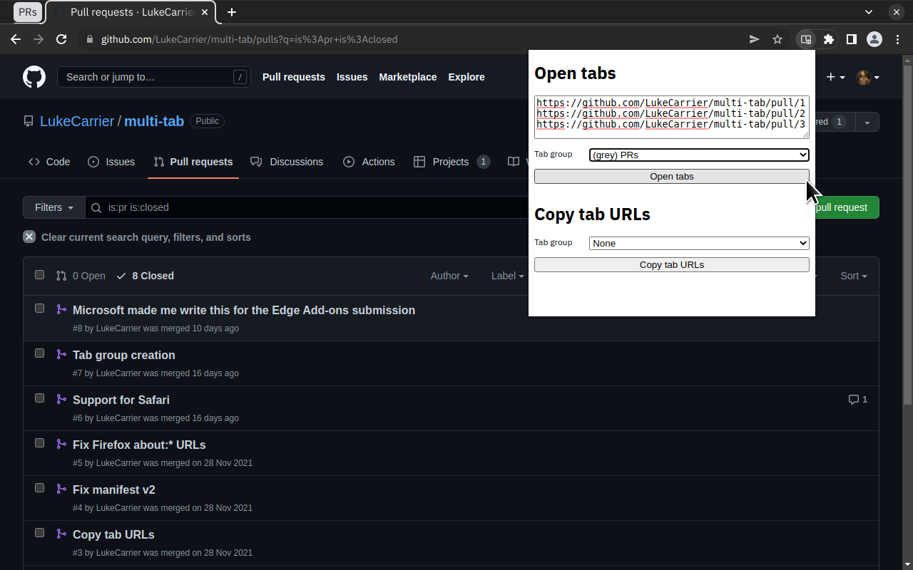

# Chrome Web Store listing

## Description

> Stop juggling tabs and let this clown do it for you.
>
> -> Paste URLs into the input, optionally select a tab group and save some serious clicking.
> -> Copy URLs from an existing tab group and paste them elsewhere.

## Category

Productivity

## Language

English (United Kingdom)

## Graphic assets

Global promo video: _none_

Store icon:

Screenshots:

Small promo tile: _none_

Large promo tile: _none_

Marquee promo tile: _none_

## Additional fields

- Official URL: _none_
- [Homepage URL](https://github.com/LukeCarrier/multi-tab)
- [Support URL](https://github.com/LukeCarrier/multi-tab/discussions)
- Mature content: off
- Google Analytics ID: _none_
