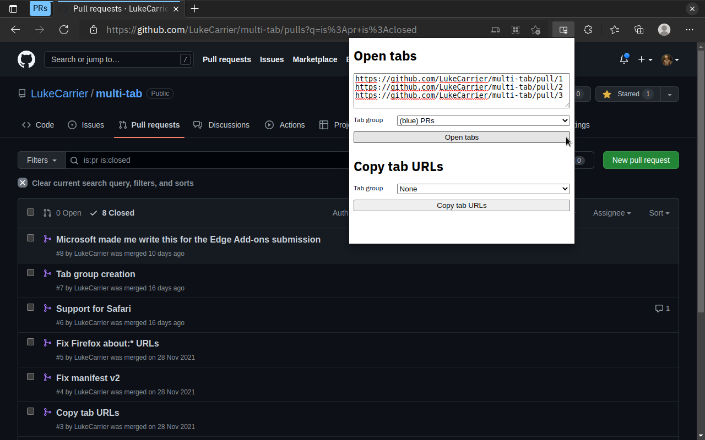

# Microsoft Edge Add-ons listing

## Description

> Stop juggling tabs and let this clown do it for you.
>
> -> Paste URLs into the input, optionally select a tab group and save some serious clicking.
> -> Copy URLs from an existing tab group and paste them elsewhere.

## Graphic assets

Extension logo:

Small promotional tile: _none_

Screenshot/s:

Large promotional tile: _none_

YouTube video URL: _none_

Search terms: _none_
