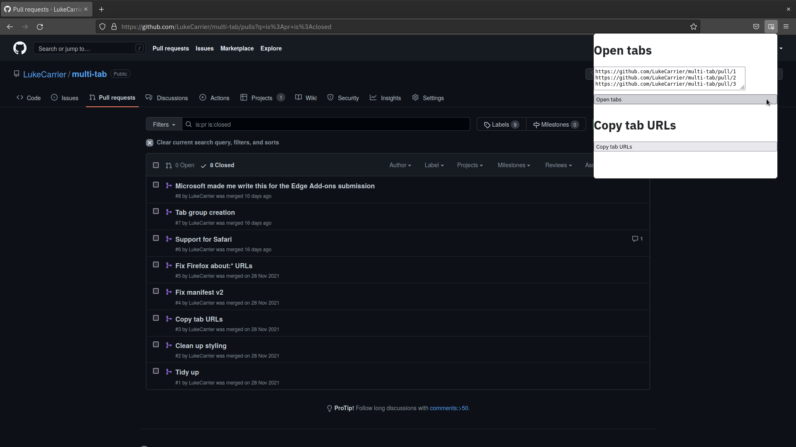

# Firefox Browser Add-ons listing

## Describe

Name: Multi-tab

Addon-URL: `lukecarrier-multi-tab`

Summary:

> A browser extension to open and group a bunch of tabs from a list of URLs.

Description:

> Stop juggling tabs and let this clown do it for you.
>
> -> Paste URLs into the input, optionally select a tab group and save some serious clicking.
> -> Copy URLs from an existing tab group and paste them elsewhere.

Experimental: `false`

Requires Payment? `false`

Categories: Tabs

Email: `luke+firefox@carrier.im`

[Web Site](https://github.com/LukeCarrier/multi-tab)

## Images

Add-on icon:

Screenshots:

## Additional details

Tags: _none_

Contributions URL: _none_

Default Locale: English (British)

[Homepage](https://github.com/LukeCarrier/multi-tab)
